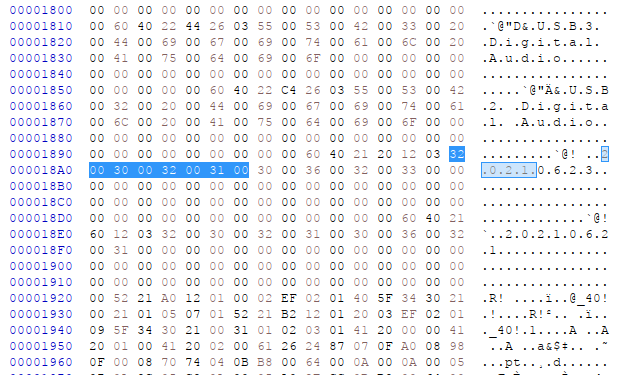
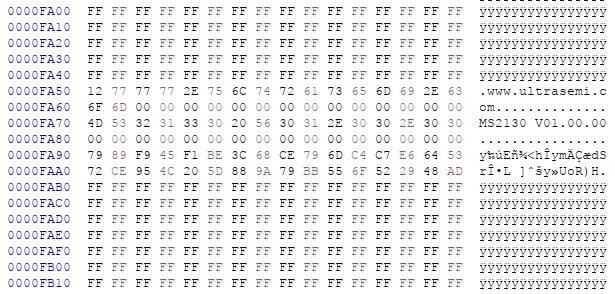
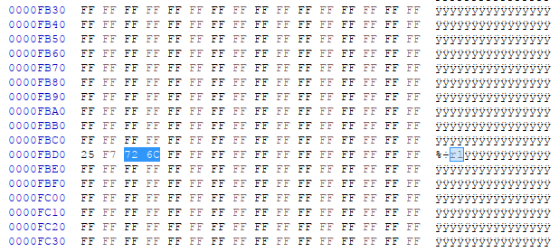
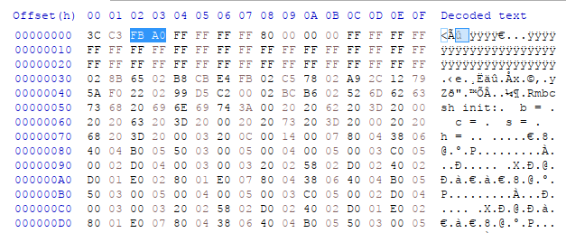

# ms2130-serial-number-configurator
ms2130-serial-number-configurator

# Introduction
This Tool attempts to change the Serial Number of MS2130 Devices and Configures a Random Serial Number for each Device.

# Motivation
I plan to use several of these MS2130 HDMI to USB Capture Cards for some cheap PiKVM Access to several Hosts.

In order for this to work, the Serial Number must be unique between different Systems, in order to be consistent across Reboots.

Even more so if passing the USB Device to a Docker/Podman/LXC Container, otherwise the Keyboard will map to the wrong Control Container between Reboots (with VERY weird Results).

# Device
This Tool has been Developed with MS2130 Device featuring the following Parameters:
- VendorID: `345f` (UltraSemi)
- ProductID: `2130` (MS2130)

The HDMI to USB Capture Card arrived with the following Serial Number Programmed (on all Devices):
```
root@HOST:/# lsusb -d 345f:2130 -vvv 2>/dev/null | grep -i serial | awk '{print $3}'
20210623
```

In this Device, the Serial Number is in a completely different Position as described in [this Repository](https://github.com/ultrasemier/ms213x_community?tab=readme-ov-file#user-data).
The Serial Number is Located at:
- Address Start (1): `0x00189F`
- Address Start (2): `0x0018E3`



I attempted to flash 16 Characters long Serial Numbers, however only the first 8 Characters are displayed in the Output of `lsusb`.

A Limit of 16 Characters has been set in order to prevent overwriting the next Data Block in the Firmware but even so, only 8 Characters will be displayed.

For this Reason, I don't think it makes sense to generate a Serial Number with more than 8 Characters, which is the Default Setting.

The Manufacturer and Version Information is configured starting at Address `0xFA51`.



# Checksum
A Firmware Checksum (Checksum-16 Algorithm) is implemented into the Firmware.

The Checksum is stored at the Following Addresses in the Firmware Flash: `0xFBD2` and `0xFBD3`.




The Checksum is computed by adding (summing) all Data located between Addresses `0x0030` (included) and `0xFBCF` (included) and returning the Result in a 16 bit unsigned Format (2^16 = 65536).

This Range of Data (Length: `0xFBA0`) seems to be defined at Address `0x0002` and `0x0003`.



# Requirements
This Tool relies on downloading and installing [ms-tools](https://github.com/BertoldVdb/ms-tools).

Easy install (requires `go` to be installed on your System):
1. `git clone https://github.com/BertoldVdb/ms-tools.git`
2. `cd ms-tools/cli`
3. `go build`

# Using the Script
The `ms-tools` requires Super-User (`root` or `sudo`) Privileges in order to access the Device Memory.

First of all, it's reccomended to Dump the Stock Firmware FLASH once Manually and store it in a Safe Place:
```
./cli --log-level=7 read FLASH 0 --filename=firmware.stock.flash.bin
```

And the EEPROM as well, although it's apparently not being used on the MS2130:
```
./cli --log-level=7 read EEPROM 0 --filename=firmware.stock.eeprom.bin
```

# Usage Examples
Configure custom Serial and reduce Logging to a Minimum:
```
sudo ./configure.py --executable ./ms-tools/cli/cli --serial 0123456789 --log-level=2
```

Configure using random Serial and reduce Logging to a Minimum:
```
sudo ./configure.py --executable ./ms-tools/cli/cli --log-level=2
```

Configure using random Serial, reduce Logging ms2130.modified.flash.2025-05-30-07-08-35.bin

Faster Method - skip Backup before AND After Serial Number Customization (NOT reccomended):
```
sudo ./configure.py --executable=./ms-tools/cli/cli --serial=0123456789 --log-level=2 --no-backup --file=firmware.stock.flash.bin
```

**IMPORTANT: Make sure to disconnect & reconnect the HDMI USB Capture Card after changing the Serial Number, in order for the Changes to take Effect**.

# Verify Serial Number Change
```
root@HOST:/# lsusb -d 345f:2130 -vvv 2>/dev/null | grep -i serial | awk '{print $3}'
L9CSC34P
```

# Testing Capture
720p:
```
ffplay -fflags nobuffer -input_format mjpeg -video_size 1280x720 -framerate 60 -color_range pc /dev/video3
```

1080p:
```
ffplay -fflags nobuffer -input_format mjpeg -video_size 1920x1024 -framerate 60 -color_range pc /dev/video3
```

# References
- https://github.com/BertoldVdb/ms-tools
- https://github.com/ultrasemier/ms213x_community
- https://github.com/steve-m/ms2130_patcher
